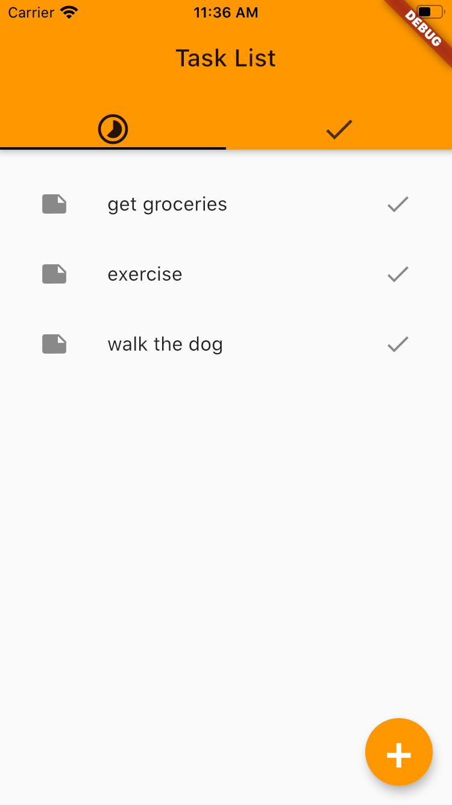
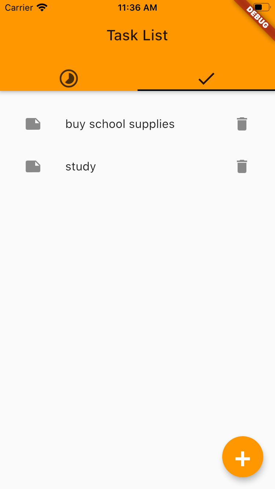
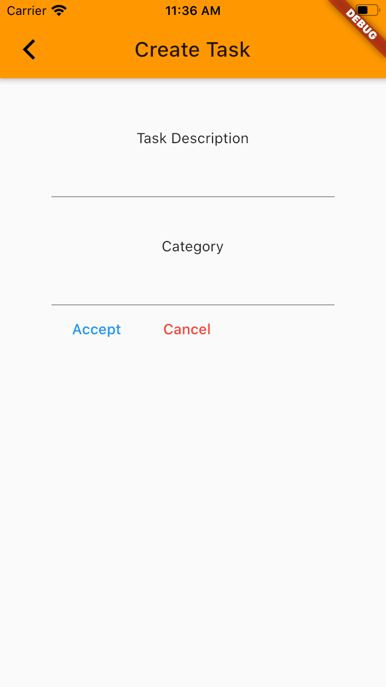

# Task App

Application where users can write down their relevant tasks. They may also declare a category for each task. They can also mark when they have completed tasks, and are able to see completed tasks in another tab.

## Implementation Details:
This project has been developed using the Flutter Framework and the Dart programming language. It has been tested in and supports both iOS and Android.

## Learning Outcomes:
- Building stateful and stateless widgets
- Using the setState function to address reactive features
- Creating classes to encapsulate information into objects
- Using streams and the StreamBuilder Widget to send and receive asynchronous events

## Screenshots:
<table>
    <td></td>
    <td></td>
    <td></td>
</table>

